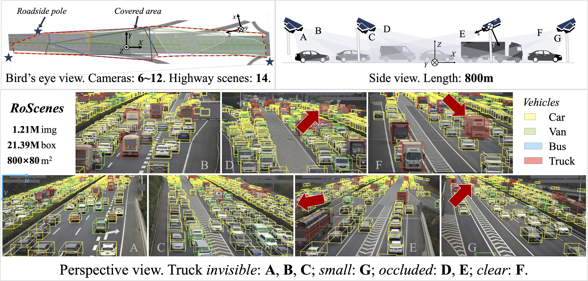

<p align="center">
  <a href="https://roscenes.github.io#gh-light-mode-only" width="15%">
  
  </a>

  <a href="https://roscenes.github.io#gh-dark-mode-only" width="15%">
  
  </a>
</p>

<p align="center" width="15%">
  <a href="https://arxiv.org/abs/2405.09883" target="_blank" width="15%">
    
  </a>

  <a href="https://roscenes.github.io" target="_blank" width="15%">
    
  </a>

  <a href="https://modelscope.cn/datasets/Apsara_Lab_Multimodal_Intelligence/RoScenes-release" target="_blank" width="15%">
    
  </a>
  
  <a href="https://pypi.org/project/roscenes/" target="_blank" width="15%">
    
  </a>

</p>

<br/>
<br/>

> [!CAUTION]
> **Commercial use of RoScenes is strictly forbidden.**

## 📰 Release Note

**[2024-07-14]** You can now download the dataset at [ModelScope](https://modelscope.cn/datasets/Apsara_Lab_Multimodal_Intelligence/RoScenes-release).

**[2024-07-13]** Devkit for RoScenes released.

**[2024-07-01]** Paper accepted to ECCV 2024! 🥳

**[2024-05-28]** Please stay tuned for the updates! We are doing final checks on data privacy.

## 🏙️ Features


<p align="center">
  <a href="https://github.com/roscenes/RoScenes#-features" width="15%">
  
  </a>
</p>


## 🔖 Table of Contents
* [🔥 Quick Start](#-quick-start)
   * [Download](#download)
   * [Install via PyPI](#install-via-pypi)
   * [Install Manually (for dev)](#install-manually-for-dev)
   * [Start Using the Dataset](#start-using-the-dataset)
* [🔎 Explore the Dataset](#-explore-the-dataset)
* [👩‍💻 Examples](#-examples)
* [📈 Evaluation](#-evaluation)
* [🎯 To-do List](#-to-do-list)

## 🔥 Quick Start

### Download

> [!NOTE]
> Please refer to [ModelScope](https://modelscope.cn/datasets/Apsara_Lab_Multimodal_Intelligence/RoScenes-release) for downloading the dataset.

After download and extract, the dataset folder should be organized as follows:

```yaml
. [DATA_ROOT] # Dataset root folder
├── 📂train # training set
│   ├── 📂s001_split_train_difficulty_mixed_ambience_day # scene 001's data
│   │   ├── 📂database # annotations, grouped by clip
│   │   │   ├── 📂0076fd69_clip_[0000000000000-0000000029529] # a clip's database, please use our devkit to read
│   │   │   └   ...
│   │   └── 📂images # images, grouped by clips
│   │       ├── 📂0076fd69
│   │       └   ...
│   ├── 📂s002_split_train_difficulty_mixed_ambience_day
│   ├── 📂s003_split_train_difficulty_mixed_ambience_day
│   ├── 📂s004_split_train_difficulty_mixed_ambience_day
│   └── 📂night_split_train_difficulty_mixed_ambience_night
│
│
├── 📂validation # validation set
│   ├── 📂s001_split_validation_difficulty_mixed_ambience_day # scene 001's data
│   ├── 📂s002_split_validation_difficulty_mixed_ambience_day
│   ├── 📂s003_split_validation_difficulty_mixed_ambience_day
│   ├── 📂s004_split_validation_difficulty_mixed_ambience_day
│   └── 📂night_split_validation_difficulty_mixed_ambience_night
│
│
└── 📂test # test set
    ├── 📂NO_GTs005_split_test_difficulty_mixed_ambience_day # scene 005's data
    ├── 📂NO_GTs006_split_test_difficulty_mixed_ambience_day
    ├── 📂NO_GTs007_split_test_difficulty_mixed_ambience_day
    ├── 📂NO_GTs008_split_test_difficulty_mixed_ambience_day
    ├── 📂NO_GTs009_split_test_difficulty_mixed_ambience_day
    ├── 📂NO_GTs010_split_test_difficulty_mixed_ambience_day
    ├── 📂NO_GTs011_split_test_difficulty_mixed_ambience_day
    ├── 📂NO_GTs012_split_test_difficulty_mixed_ambience_day
    ├── 📂NO_GTs013_split_test_difficulty_mixed_ambience_day
    └── 📂NO_GTs014_split_test_difficulty_mixed_ambience_day

```

### Install via PyPI
Use PyPI to directly install RoScenes devkit:

```python
pip install roscenes
```
### Install Manually (for dev)
Also, you can clone this repository and install roscenes manually for developing.

```bash
git clone https://github.com/roscenes/RoScenes.git

cd RoScenes

pip install -e .
```

### Start Using the Dataset

```python
import roscenes as ro

# load the training set
dataset = ro.load('[DATA_ROOT]/train/*')
# number of total frames
print(len(dataset))
```

Then, we can iterate over the dataset, in two ways:

You can use indexing:
```python
# use integer indexing
index = 10
# a Frame instance
print(type(dataset[index]))

for i in range(len(dataset)):
    # print num of objects for every frame
    print(len(dataset[index].boxes3D))
```
OR, you can directly iterate it:
```python
# a frame instance
for frame in dataset:
    print(len(frame.boxes3D))
```

> [!IMPORTANT]
> Please refer to [`frame.py`](roscenes/data/frame.py), [`camera.py`](roscenes/data/camera.py) for the detailed comments on box format, instrinsic and extrinsic definition, etc.


## 🔎 Explore the Dataset

`python -m roscenes.visualizer [DATA_ROOT]/train/s001_split_train_difficulty_mixed_ambience_day 0 vis_result`

TBD.

## 👩‍💻 Examples

* **1. Read all boxes in a frame, and convert them from global 3D coordinates to camera's perspective coordinates.**


## 📈 Evaluation

TBD.


## 🎯 To-do List
- [x] Devkit release
- [x] Dataset release
- [ ] Example dataset loader based on [`MMDetection3D`](https://github.com/open-mmlab/mmdetection3d)
- [x] 3D detection task and evaluation suite
- [ ] 3D tracking task and evaluation suite

<br/>
<br/>
<p align="center">
<b>
This repo is licensed under
</b>
</p>
<p align="center">
<a href="https://www.apache.org/licenses/LICENSE-2.0#gh-light-mode-only" target="_blank">
  
</a>

<a href="https://www.apache.org/licenses/LICENSE-2.0#gh-dark-mode-only" width="15%">
  
  </a>
</p>

<p align="center">
<a href="https://raw.githubusercontent.com/roscenes/RoScenes/main/LICENSE">
  <b>Apache License<br/>Version 2.0</b>
</a>
</p>
